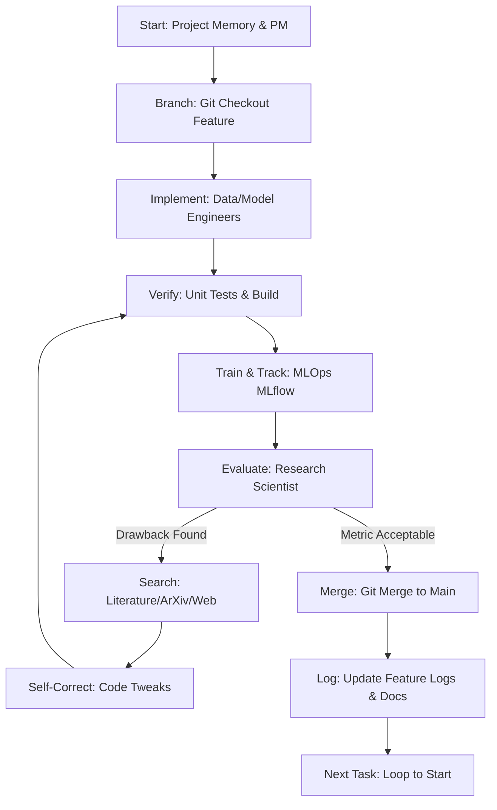

When the user invokes `/autonomous-loop`, execute the following loop until milestones are satisfied or targets are met.

## Autonomous Execution Sequence

### Detailed Workflow Step Details

1. **Initial Workspace Check**
   - Check active branch status.
   - Sync project state and load backlog priorities.

2. **Parallel Feature Branching**
   - Project Manager selects a task from the backlog.
   - Checkout a feature branch: `git checkout -b feature/<module_name>-<task>`.

3. **Incremental Implementation**
   - Write module code according to HLD/LLD interfaces.
   - Guard changes with unit tests.

4. **Experimentation & Metric Evaluation**
   - MLOps runs training scripts with MLflow integration.
   - Research Scientist inspects logged metrics (subset accuracy, Macro F1, ROC-AUC).

5. **Drawback Resolution Loop**
   - If performance is suboptimal or a training run crashes:
     - Search online literature/databases for the specific blocker.
     - Automatically implement the recommended optimization (e.g., learning rate tuning, layer normalization adjustments, loss scaling).
     - Re-run verification tests and training.

6. **Merging and Memory Logging**
   - Switch back to `main`.
   - Merge the feature branch: `git merge feature/<module_name>-<task>`.
   - Record outcomes in `research/<feature_name>/research_log.md` and update `project_state.md`.
