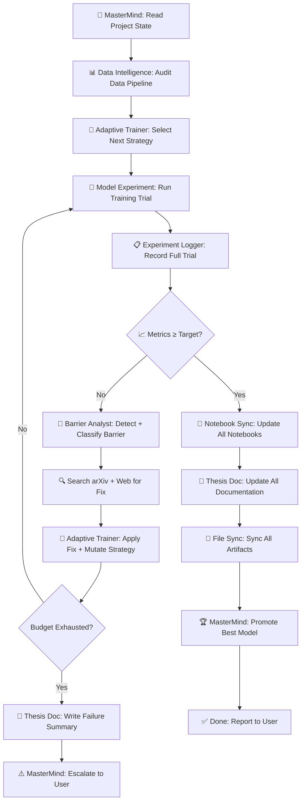

# /mastermind-loop

The MasterMind loop is the highest-level autonomous workflow in the ECG
Foundation Representation System. It manages the full experiment lifecycle
without user intervention between trials.

---

## Flow Diagram



---

## Detailed Step-by-Step

### Step 1 — MasterMind: Initialize

**Agent:** `@mastermind`  
**Skill:** `experiment-orchestrator`

Actions:
- Read `project_state.md` to understand current phase and completed work.
- Read `backlog.md` to understand pending experiments.
- Read `mastermind_state.md` if resuming a previous loop.
- Load the strategy queue from `search_history.md` + `strategy_queue.md`.
- Set the **target metric** (default: ROC-AUC ≥ 0.92 on PTB-XL test set).
- Set the **trial budget** (default: 20 trials per loop run).
- Log loop start to `mastermind_state.md`.

---

### Step 2 — Data Intelligence: Audit Data Pipeline

**Agent:** `@data-intelligence`  
**Skill:** `data-audit`

Actions:
- Read current dataset config from `config/` or training script.
- Count records per split (train / val / test).
- Compute per-label class distribution for each split.
- List all preprocessing steps as applied.
- List augmentation strategies and probabilities.
- Flag any known data quality issues.
- Write `data_audit.md` to `trials/<trial_id>/data_audit.md`.
- Return audit summary to MasterMind.

> **Skip if:** Data pipeline is unchanged since last trial (compare checksums).

---

### Step 3 — Adaptive Trainer: Select Next Strategy

**Agent:** `@adaptive-trainer`  
**Skill:** `adaptive-strategy-search`

Actions:
- Read last trial outcome from `experiment_journal.md`.
- Read any barrier fix from the latest barrier report.
- Apply mutation rules to generate the next strategy config.
- Check config against `search_history.md` — avoid duplicates.
- Write new strategy to `strategy_queue.md`.
- Return the strategy config to MasterMind.

> **On first run:** Initialize from the default strategy (BiLSTM + MAE).

---

### Step 4 — Model Experiment: Run Training Trial

**Agent:** `@model-experiment`  
**Skill:** `model-engineering` + `mlflow-manager`

Actions:
- Receive strategy config from MasterMind.
- Start MLflow run under the appropriate experiment.
- Log all hyperparameters.
- Execute training loop (may be long-running — runs in background).
- Log per-epoch metrics to MLflow.
- Save best checkpoint.
- Log final test metrics.
- Return structured `trial_result` object with:
  - `trial_id`
  - `mlflow_run_id`
  - `metrics` (ROC-AUC, Macro F1, Subset Acc, Val Loss)
  - `config` (full hyperparameter set)
  - `checkpoint_path`
  - `training_time`

---

### Step 5 — Experiment Logger: Record Full Trial

**Agent:** `@experiment-logger`  
**Skill:** `experiment-file-sync`

Actions:
- Append full trial record to `experiment_journal.md`.
- Update `mastermind_state.md` with latest metrics.
- Update `search_history.md` with this trial's config + outcome.
- Update `outputs/reports/experiments_comparison_report.md`.
- Write per-trial report to `outputs/reports/trial_<N>_report.md`.
- Confirm MLflow artifacts are stored correctly.

---

### Step 6 — Metric Evaluation

**Agent:** `@mastermind`

Decision:
```
IF trial.roc_auc >= target_roc_auc:
    → Go to Step 9 (Notebook Sync)
ELSE:
    → Go to Step 7 (Barrier Detection)
```

---

### Step 7 — Barrier Analyst: Detect + Classify Barrier

**Agent:** `@barrier-analyst`  
**Skill:** `barrier-detection`

Actions:
- Read trial result metrics and training logs.
- Classify the barrier type (overfitting, underfitting, gradient issue, etc.).
- Search arXiv and web for relevant solutions.
- Formulate 2–3 concrete, literature-backed fixes.
- Write `barrier_<trial_id>.md` to `.agents/project/research/mastermind/barriers/`.
- Append shortcomings to `.agents/project/research/mastermind/shortcomings.md`.
- Return structured fix config to MasterMind.

---

### Step 8 — Adaptive Trainer: Apply Fix + Mutate Strategy

**Agent:** `@adaptive-trainer`  
**Skill:** `adaptive-strategy-search`

Actions:
- Receive fix config from `@barrier-analyst`.
- Override relevant fields in the next strategy config.
- Apply additional mutations as needed.
- Write updated strategy to `strategy_queue.md`.

**Budget check:**
```
IF trials_run >= max_trials:
    → Go to Step 10 (Escalate to User)
ELSE:
    → Return to Step 4 (Run Training Trial)
```

---

### Step 9 — Notebook Sync: Update All Notebooks

**Agent:** `@notebook-sync`  
**Skill:** `notebook-sync`

Actions:
- Identify relevant notebook(s) based on the trial module.
- Append 3-cell experiment block (header + metrics + barriers/next steps).
- Preserve all existing cells.
- Write updated notebook to disk.

---

### Step 10 — Thesis Doc: Update All Documentation

**Agent:** `@thesis-doc`  
**Skill:** `thesis-writer`

Actions:
- Append trial section to `docs/<module>/thesis_notes.md`.
- Update `docs/<module>/experiment_log.md`.
- Append barrier findings to `docs/<module>/thesis_notes.md` (Limitations section).
- Update `future_work.md` with new research directions identified.
- Update `shortcomings.md` with honest limitations.

---

### Step 11 — File Sync: Sync All Artifacts

**Agent:** `@experiment-logger`  
**Skill:** `experiment-file-sync`

Actions:
- Run the full sync checklist.
- Ensure `experiments_comparison_report.md` is current.
- Confirm all research files are consistent.
- Stage all changes: `git add -A`.
- Prepare commit message: `"[Trial <N>] <Architecture> + <Strategy> — ROC-AUC: <value>"`.

---

### Step 12 — MasterMind: Promote Model or Escalate

**If target reached:**
- Register best model in MLflow Model Registry.
- Run `/sync-workspace` workflow.
- Generate final experiment summary report.
- Notify user with full outcome.

**If budget exhausted:**
- Report best model found across all trials.
- Write full search summary to `mastermind_state.md`.
- Request user guidance on next steps.
- List all tried strategies and their outcomes.

---

## State Files

All loop state is maintained in:

```
.agents/project/research/mastermind/
  mastermind_state.md      ← current loop state
  experiment_journal.md    ← full trial history
  strategy_queue.md        ← pending strategies
  search_history.md        ← all tried configs + outcomes
  convergence_log.md       ← plateau history
  shortcomings.md          ← all documented barriers and limitations
  future_work.md           ← research directions for future work
  barriers/
    barrier_<trial_id>.md  ← one barrier report per failing trial
```

---

## Default Parameters

| Parameter | Default | Override |
|---|---|---|
| Target ROC-AUC | 0.92 | `--target-auc <value>` |
| Max Trials | 20 | `--max-trials <N>` |
| Max Barrier Retries | 3 | `--max-retries <N>` |
| Dataset | PTB-XL full | `--dataset <name>` |
| Starting Architecture | ECGTransformer | `--arch <name>` |
| Starting Strategy | MAE | `--strategy <name>` |

---

## Resuming an Interrupted Loop

If the loop is interrupted mid-trial:

1. Read `mastermind_state.md` to get the last completed trial ID.
2. Read `strategy_queue.md` to get the next pending strategy.
3. Check MLflow for any partially-completed runs (clean up RUNNING state).
4. Resume from **Step 3** (Adaptive Trainer: Select Next Strategy).

---

## Loop Termination Conditions

| Condition | Action |
|---|---|
| `roc_auc >= target` | Promote model → sync → report |
| `trials >= max_trials` | Report best found → ask for guidance |
| Same barrier 3× consecutive | Escalate immediately to user |
| All strategies exhausted | Report + suggest new search space |
| User sends `HALT` | Save state → clean exit |
