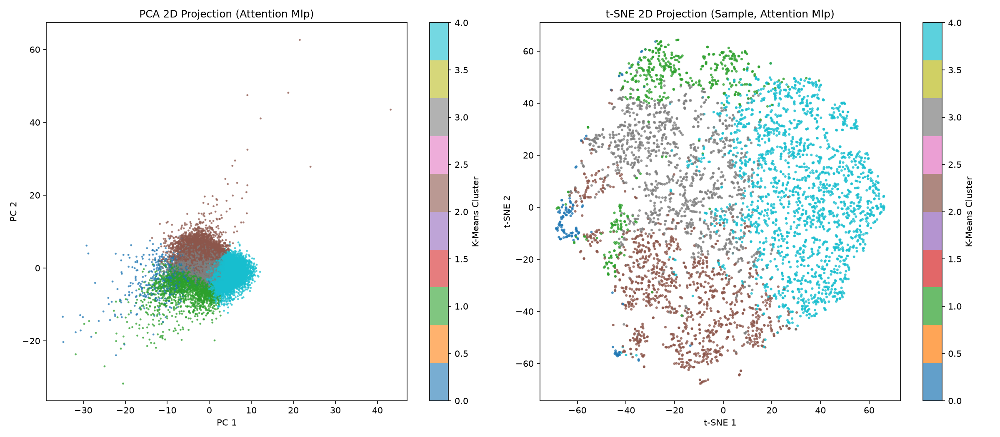
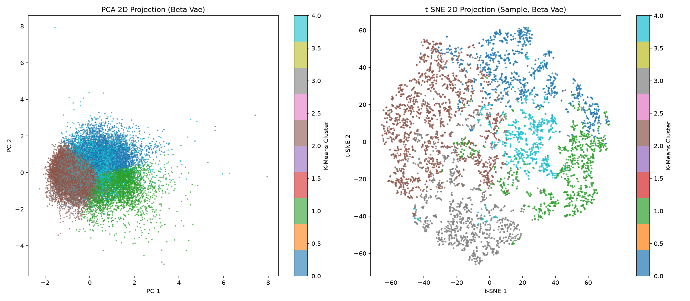
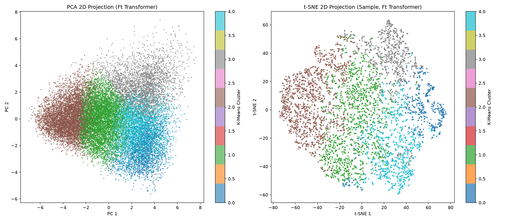

# ECG Biomarker Embedding Clustering Validation Report

Generated at: 2026-08-14 23:53:16

## Executive Summary

We performed unsupervised clustering validation on the 32-dimensional latent representation spaces learned by **Attention MLP**, **Beta-VAE**, and **FT-Transformer** autoencoders. Using K-Means clustering (K=5) without providing diagnostic labels during training or clustering, we evaluate how well the latent representations naturally segregate based on the underlying physiological ECG classes.

## 1. Unsupervised Clustering Metrics Comparison

| Model Type | Silhouette Score (K=5) | Adjusted Rand Index (ARI) | Normalized Mutual Info (NMI) |
| --- | --- | --- | --- |
| Attention Mlp | 0.142289 | 0.330123 | 0.238636 |
| Beta Vae | 0.179742 | 0.179351 | 0.156907 |
| Ft Transformer | 0.147646 | 0.246966 | 0.231813 |

> [!NOTE]
> **Metric Interpretations**:
> - **Silhouette Score**: Measures cluster compactness and separation. Higher means clusters are better defined.
> - **Adjusted Rand Index (ARI)**: Measures agreement between clustering and actual dominant diagnostic classes (corrected for chance). 0 represents random alignment, 1 is perfect alignment.
> - **Normalized Mutual Information (NMI)**: Measures mutual information scaling between clusters and labels. Higher NMI indicates stronger alignment of latent clustering with medical diagnoses.

## 2. Cluster-to-Class Prevalence Breakdown

### Attention Mlp Clusters

| Cluster | Size | NORM | MI | STTC | CD | HYP | Primary Diagnostic Class |
| --- | --- | --- | --- | --- | --- | --- | --- |
| 0 | 612 | 0.33% | 20.42% | 21.24% | 72.88% | 26.47% | CD |
| 1 | 2204 | 16.52% | 25.82% | 51.81% | 17.24% | 59.03% | STTC |
| 2 | 5010 | 9.24% | 59.40% | 21.18% | 47.66% | 10.22% | MI |
| 3 | 5129 | 29.75% | 20.53% | 48.84% | 14.88% | 8.62% | STTC |
| 4 | 8853 | 81.02% | 8.52% | 3.22% | 10.35% | 2.65% | NORM |

### Beta Vae Clusters

| Cluster | Size | NORM | MI | STTC | CD | HYP | Primary Diagnostic Class |
| --- | --- | --- | --- | --- | --- | --- | --- |
| 0 | 3791 | 13.48% | 40.68% | 36.48% | 37.25% | 8.05% | MI |
| 1 | 3586 | 16.93% | 22.53% | 54.99% | 22.25% | 37.45% | STTC |
| 2 | 7246 | 68.91% | 12.41% | 7.87% | 17.47% | 3.97% | NORM |
| 3 | 4456 | 72.02% | 12.68% | 8.39% | 10.64% | 6.58% | NORM |
| 4 | 2729 | 7.62% | 60.94% | 30.19% | 34.55% | 15.50% | MI |

### Ft Transformer Clusters

| Cluster | Size | NORM | MI | STTC | CD | HYP | Primary Diagnostic Class |
| --- | --- | --- | --- | --- | --- | --- | --- |
| 0 | 2254 | 3.95% | 46.27% | 18.86% | 63.22% | 16.10% | MI |
| 1 | 6410 | 53.63% | 16.57% | 16.04% | 20.92% | 6.55% | NORM |
| 2 | 6186 | 86.70% | 5.00% | 2.10% | 7.68% | 3.33% | NORM |
| 3 | 3074 | 8.17% | 24.72% | 69.06% | 17.57% | 37.90% | STTC |
| 4 | 3884 | 9.96% | 59.29% | 36.48% | 28.63% | 12.82% | MI |

## 3. Dimensionality Reduction Visualizations

Visualizations show 2D projections of the latent space color-coded by unsupervised K-Means clusters.

### Attention Mlp Latent Space

### Beta Vae Latent Space

### Ft Transformer Latent Space

## 4. Diagnosis and Natural Separation Verdict

Based on clustering validation, **Attention Mlp** shows the best natural diagnostic separation in its unsupervised latent representations. Its latent coordinates group records in a way that correlates most cleanly with actual diagnostic labels, rendering it highly suitable for downstream linear probing and downstream clustering applications.
