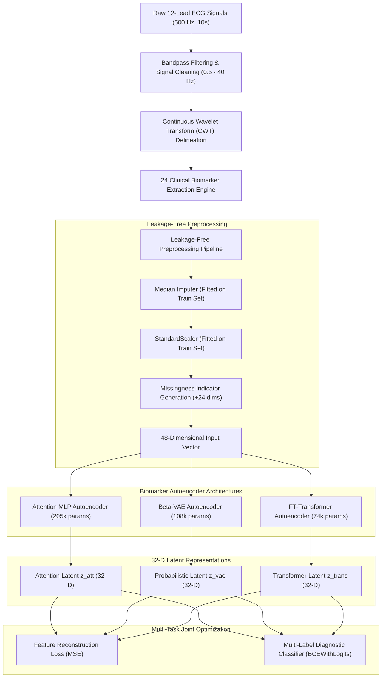

# Biomarker Encoder High-Level Design (HLD)

## 1. Executive Overview
The **Biomarker Encoder Subsystem** is an essential domain-knowledge foundation layer in the 12-lead ECG Representation Learning Architecture. While raw signal encoders (such as Temporal LSTMs and Morphological ResNets) learn representations directly from time-series waveform topologies, the Biomarker Encoder explicitly captures physiologically validated clinical metrics (durations, intervals, axes, amplitudes, and ST segment shifts).

By projecting these 24 extracted clinical features into dense, regularized 32-dimensional latent representations, the Biomarker Encoder provides the downstream Fusion Engine with structured, interpretable, and orthogonal medical indicators.

---

## 2. Subsystem Architecture

---

## 3. Key Design Principles

1. **Clinical Fidelity & Physiological Calibration**:
   - Extraction uses Continuous Wavelet Transform (CWT) to accurately delineate P-wave onsets/offsets and QRS complexes.
   - Prevents the systematic measurement overestimation observed in Discrete Wavelet Transform (DWT) baseline delineators (restoring median QRS duration to ~105.8 ms and PR interval to ~148.0 ms).

2. **Strict Data Leakage Prevention**:
   - Zero patient overlap across splits (stratified patient-wise partitioning).
   - Preprocessing objects (`SimpleImputer` and `StandardScaler`) are fit strictly on the training partition and transformed across validation and test sets.

3. **Multi-Task Latent Regularization**:
   - Latent embeddings are learned through a combined loss function:
     $$\mathcal{L} = \mathcal{L}_{\text{reconstruction}} + \lambda \mathcal{L}_{\text{classification}}$$
   - Forces the latent space to simultaneously preserve physical feature reconstruction fidelity while clustering diagnostic pathologies (NORM, MI, STTC, CD, HYP).

4. **Modular & Interoperable Embeddings**:
   - Encoders output standardized 32-dimensional latent vectors `(Batch, 32)` compatible with the downstream multi-encoder Adaptive Fusion Engine.

---

## 4. Subsystem Components & Responsibilities

| Component | Module Path | Primary Responsibility |
|---|---|---|
| **Extraction Engine** | `biomarkers/extract_features_cwt.py` | Signal filtering, CWT delineation on Lead II/V5/V1/I, computation of 24 clinical features, and QC logging. |
| **Leak-Free Preprocessor** | `biomarkers/preprocess.py` | Training-split median imputation, z-score standardization, and missingness binary flag generation. |
| **Model Architectures** | `biomarkers/models.py` | PyTorch implementations of `AttentionMLPAutoencoder`, `BetaVAE`, and `FTTransformerAutoencoder`. |
| **Trainer & Multi-Task Optimizer** | `biomarkers/retrain_leakage_free.py` | Multi-task training loop with AdamW, ReduceLROnPlateau, early stopping, and checkpoint saving. |
| **Evaluation Harness** | `biomarkers/evaluator.py`, `eval_improved.py` | Downstream Logistic Regression benchmarking with validation-set threshold optimization, latent variance analysis, and PCA/t-SNE clustering. |

---

## 5. Downstream Integration with Fusion Engine
The Biomarker latent representations are concatenated or cross-attended with:
- **Temporal Encoder** (128-D BiLSTM / Transformer representations from raw time-series)
- **Morphology Encoder** (128-D ResNet / ConvNet representations from beat-aligned QRS complexes)

Together, they form the unified multi-view ECG representation vector for pan-cardiac diagnostic classification.
